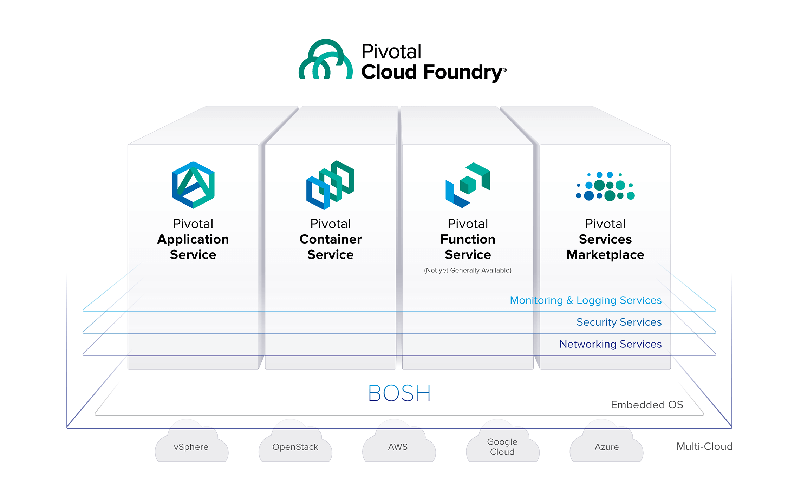
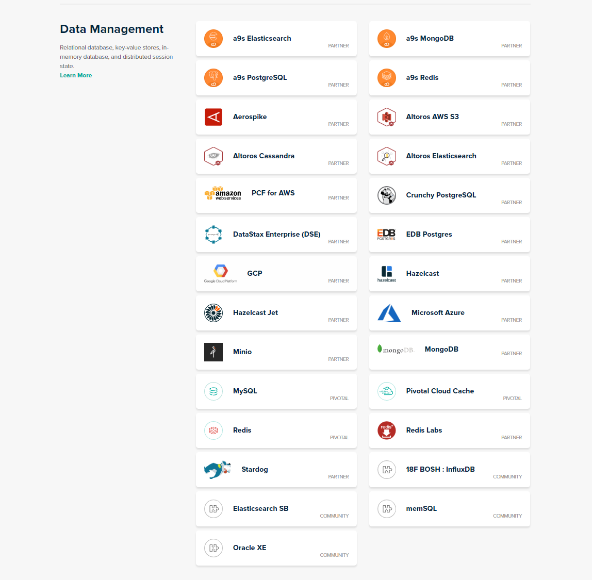

## Learn Pivotal Notes

This note contains some of my personal learning and thinking on pivotal platform

### Pivotal Product Concepts:

#### 1. Pivotal Cloud Foundry (PCF)

This is the core product of pivotal. It can help the companys or organsations 
to create enterprise level PaaS cloud. 

##### Why I want to use Pivotal:

For example, company X owns hundreds of server (physical machines). 
They are using traditional way to maintains these server, and they are also suffering the high cost to hiring a operation team to manage these servers.
The management knows move to cloud platform (Azure and AWS are smiling here) can reduce the operational cost but they don't want to just let hundreds of physical server being idle.

In this situation, I think pivotal will be the best fit to solve the problem. Introduce Pivotal PCF can transfer these servers to a private cloud which have the PaaS experiences and utilize hundreds of machines as well. 
Also, company can add more nodes in the future if the platform meets the bottleneck, these machines can be hosting on other IaaS platform or physical ones.

Hence, if the organisation have the following requirements or demand than I think pivotal will be the option:

###### 1. Don't want to stick to one cloud platform, no matter what the reason of, cost, security, etc.
###### 2. Owns in-house servers and want to be benefit from cloud computing.
###### 3. Want to establish private cloud and ensure the data is safe.

Below is the Pivotal Cloud Foundry Layer Diagram:



##### Why I don't want to use Pivotal:

However, there has some scenarios I will not consider pivotal.

###### 1. If the organisation have clear strategy only stick with one cloud platform, especially Azure and AWS. 

Here I took Azure as example to demonstrate why I will not use Pivotal if the above condition met.



We can see Pivotal providing many different types of database here, like SQL, Redis, NoSql, etc. 
However I can tell you all these services will also be provided by Azure or AWS. Furthermore, they will provide something which pivotal will not or not yet provide, like Hadoop, Data warehouse.
Not only on the data management category, Azure and AWS also have many cutting-edge resources for use, like AI, Gaming, Blockchain. 
What I want to demonstrate here is, comparing to Azure and AWS, the eco-system of pivotal still not big enough to compete with these tech giants. 
But one good thing is pivotal also integrate with these giant platform which means these cutting-edge technologies having possibility be using on the Pivotal.

#### 2. Pivotal Applicatoin/Web Service

I don't know which name is correct but I think they are both pointing to the same thing. From my point of view, this is a public (commercial) instance of PCF which offering by Pivotal.
When I first time looking into pivotal documentation, there has heaps of documentation to teach you how to install PCF on server or on other cloud platforms. 
A little frustrating face in my brain saying: I don't want to install this seems like it very complicated. Oh, it's will cost me money if I install this on cloud platform. 
Install to local? It's take 20G, you know how expensive the SSD, I even don't have enough space for my dev tools. One word summary, I just don't want to install it, at least in the very begining. 

However, one post on StackOverFlow saved me the poster mentioned Pivotal Web Service is a commerical product of PCF. 
And I tried to register that and when I get into the portal I knew I make the right decision.It's a admin panel although it's simple but I can imaging even if I install the PCF into some hosting machine they will show up the similar stuff.

Thus, if you only want to learn how to use the Pivotal PCF, here is a good start.

#### 3. Concourse CI

Concourse CI is a CI/CD solution which built by Pivotal. It's integrated with Pivotal well. However, concourse is also a stand-alone product which means you can also used it on other platforms. 
You can think concourse is a Jenkins replacement or competitor. 

##### Install Concourse

Before install concourse please your machine/environment have install the following tools:

1. [Docker](https://www.docker.com/products/docker-engine)
2. [Docker Compose](https://docs.docker.com/compose/install/#install-compose)

Download the [docker compose file](https://github.com/concourse/concourse-docker/blob/master/docker-compose-quickstart.yml) and navigate to the file location and run the following command:

```
docker-compose up -d
```

If you can see something below than your install success:


Or, you can go to `http://localhost:8080` to check your installation.


Besides install the concourse server on your machine you also need to install two cli tools, **fly** and **concourse** you can download it from [HERE](https://concourse-ci.org/download.html) 

##### Learn Concourse

To start with learning concourse I recommend you to read this [tutorial](https://concoursetutorial.com/) which also strongly recommend by Concourse offical. 
Here I only list out some common usage:

###### 1. Login to the server via fly

```
fly -t poc login -c http://localhost:8080
```

**poc** is a target variable which you can define, thus you can assign any string wihch fit into your scenario.

The first time execute this command you also need to execute `fly -t poc sync` to ensure your fly cli have same version with concourse

###### 2. Execute Job via fly

```
fly -t poc e -c task_hello_world.yml
```

To execute this command you need to have a job configuration file, the most simple one is something like:

```
---
platform: linux

image_resource:
  type: docker-image
  source: {repository: busybox}

run:
  path: echo
  args: [hello world]
```
This configuration code describe create a container with `busybox` image and run command `echo hello world`

###### 3. Set Pipeline via fly

```
fly -t poc set-pipeline -c pipeline.yml -p test-pipeline
```

**test-pipeline** is the name of your pipeline, thus you can define with your scenario. This command means set pipeline from pipeline.yml name it test-pipeline in poc target environment.

Here is my pipeline yml file:

```
resources:
- name: code-source
  type: git
  source:
     uri: https://github.com/skyline9002/PivotalPoc
     branch: master
- name: pcf
  type: cf
  source:
     api: https://api.run.pivotal.io
     skip_cert_check: false
     username: xxxxxxx
     password: xxxxxxx
     organization: pivotal-simon-huang
     space: development

jobs:
-  name: aspnetcore-unit-tests
   plan:
     - get: code-source
       trigger: true
     - task: run-tests
       privileged: true
       config:
          platform: linux
          inputs:
          - name: code-source
          image_resource:
            type: docker-image
            source:
              repository: microsoft/aspnetcore-build
          run:
             path: sh
             args:
             - -exc
             - |
               cd ./code-source/Concourse.Test
               dotnet restore
               dotnet test

-  name: deploy-to-prod
   plan:
     - get: code-source
       trigger: true
       passed: [aspnetcore-unit-tests]
     - put: pcf
       params:
         manifest: code-source/manifest.yml
```

This pipeline do the two thing, first doing the unit test in **Concourse.Test** project, then depoly **Concourse.Api** project to pivotal